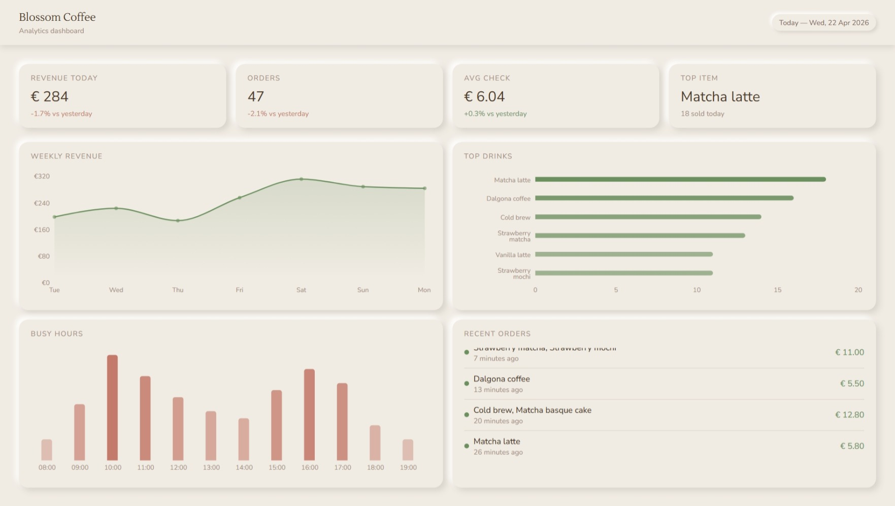

# Blossom Coffee — Analytics Dashboard

A analytics dashboard for a Blossom Coffee café built with Next.js and TypeScript.



## Live demo

[dashboard-blossom-coffee.vercel.app](https://dashboard-blossom-coffee.vercel.app)

## Features

- KPI cards with today's revenue, number of orders, average check and top item
- Weekly revenue area chart
- Top drinks horizontal bar chart
- Busy hours bar chart by time of day
- Recent orders table with status indicators and relative time
- All data is mocked and defined in `data/mockData.ts`. No external API or database is required

## Tech stack

- Next.js 16
- TypeScript
- Tailwind CSS v4
- Recharts
- date-fns

## Getting started

```bash
git clone https://github.com/sotluf/dashboard-blossom-coffee.git
cd dashboard-blossom-coffee
npm install
npm run dev
```

Open [http://localhost:3000](http://localhost:3000) in your browser.